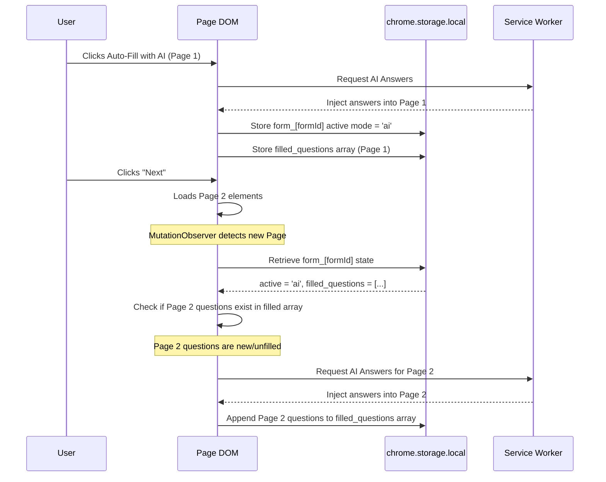

# 🧠 Detailed Documentation & System Architecture

This document provides a deep dive into the engineering, architecture, and security model of the **FormBhar Google Forms AI Auto-Filler** Chrome Extension and its integrated backend.

For basic installation and usage instructions, please refer to the main [README.md](README.md).

---

## 🏗️ System Flow & Architecture

FormBhar is composed of a **Manifest V3 Browser Extension** (executing in isolated contexts for DOM observation, input simulation, and secure API orchestrations) and a **Telemetry Backend** (mediating aggregate telemetry for statistics).

Below is the comprehensive architecture diagram detailing the secure message routing, styling isolation (Shadow DOM), client state mappings, and service worker fallbacks:

```mermaid
graph TB
    subgraph ClientTab ["Google Form Client Tab (Light DOM)"]
        FormDOM["Google Form DOM<br/>(Heavy React / Closure Elements)"]
    end

    subgraph ContentScriptContext ["Content Script Context (Isolated DOM & State)"]
        subgraph ShadowContainer ["Shadow DOM Wrapper (#formbhar-shadow-host)"]
            Root["Shadow Root<br/>(Style & Context Isolation)"]
            Font["Google Outfit Font Stylesheet"]
            FlexContainer["Capsule Dock Flex Container<br/>(flex-direction: column-reverse; gap: 12px; align-items: flex-end)"]
            Buttons["Floating Premium HUD Action Buttons:<br/>- ai-autofill-btn<br/>- chatgpt-mode-btn / paste-answers-btn<br/>- fill-profile-btn"]
            
            Root --> Font
            Root --> FlexContainer
            FlexContainer --> Buttons
        end

        DomObserver["domObserver.js<br/>- MutationObserver Settling (600ms debounce)<br/>- Page Transition & Auto-Triggering Listener"]
        FormReader["formReader.js<br/>- Universal Form Context Extractor<br/>- ARIA / Semantic Input Parsing"]
        FormFiller["formFiller.js<br/>- React/Closure Emulation Sequence:<br/>  focus ➔ keydown ➔ input ➔ change ➔ compositionend ➔ keyup ➔ blur<br/>- flatMap multi-section question filling"]

        DomObserver -->|Injects| ShadowContainer
        DomObserver -->|Scrapes| FormReader
        FormReader -->|Sends Context| FormFiller
        FormFiller -->|Simulates inputs & dispatches events| FormDOM
    end

    subgraph ExtensionStorage ["Chrome Storage API"]
        LocalStorage["chrome.storage.local<br/>- Form-specific state: form_[formId]<br/>  ➔ autofill_active (ai/profile)<br/>  ➔ filled_questions (Array)<br/>  ➔ completed_auto (Boolean)<br/>- API Keys: geminiApiKey, openaiApiKey, claudeApiKey<br/>- User profile details & form history"]
    end

    subgraph ServiceWorkerContext ["Chrome Service Worker Context (Background)"]
        BackgroundJS["background.js<br/>- Central MV3 ES Module Message Router<br/>- Telemetry triggers & analytics telemetry"]
        SessionManager["sessionManager.js<br/>- Transaction Protection<br/>- Issues 5-min cryptographically secure tokens"]
        AnalyticsJS["analytics.js<br/>- Ephemeral MV3 service worker wakeup system<br/>- Alarms ping loop orchestration"]
        
        subgraph ProviderManagerEngine ["Provider Manager Engine"]
            PM["providerManager.js<br/>- Quota-aware fallback<br/>- Dynamic configuration sorting & filtering<br/>- Fallback random jitter (1s - 3s)"]
            OpenAI["openaiProvider.js<br/>- Strict API key checking<br/>- GPT-4o-mini generation"]
            Gemini["geminiProvider.js<br/>- Strict API key checking<br/>- Gemini 1.5 Pro generation"]
            Claude["claudeProvider.js<br/>- Strict API key checking<br/>- Claude 3 Haiku generation"]
            
            PM --> OpenAI
            PM --> Gemini
            PM --> Claude
        end

        BackgroundJS --> SessionManager
        BackgroundJS --> AnalyticsJS
        BackgroundJS --> PM
    end

    subgraph BackendInfrastructure ["Production Backend Infrastructure"]
        Render["Render Telemetry Web Server<br/>- Production Node.js / Express Server<br/>- Compliance telemetry endpoints"]
        Supabase["Supabase Cloud Database<br/>- Managed PostgreSQL database tables:<br/>  ➔ users, sessions, form_logs"]
        
        Render --> Supabase
    end

    %% State Synchronization Lines
    DomObserver <-->|Asynchronously reads/writes form_[formId] state| LocalStorage
    FormFiller <-->|Saves history & loads user profile| LocalStorage
    BackgroundJS <-->|Retrieves keys & provider setting| LocalStorage
    PM <-->|Reads active credentials for sorting| LocalStorage

    %% Message Passing Lines
    DomObserver -->|sendMessage: GENERATE_ANSWERS| BackgroundJS
    BackgroundJS -->|sendMessage: TRIGGER_AUTO_FILL / TRIGGER_PROFILE_FILL| DomObserver
    BackgroundJS -->|POST /api/stats| Render
    
    %% API External Endpoints
    OpenAI -->|HTTPS FETCH| OAI_API["api.openai.com"]
    Gemini -->|HTTPS FETCH| GEM_API["generativelanguage.googleapis.com"]
    Claude -->|HTTPS FETCH| CLA_API["api.anthropic.com"]
```

---

## 🔄 Detailed Flowchart & Execution Lifecycle

The following flowchart maps out the complete execution sequence, from the initial page loading through state recovery, DOM settling, dynamic sorting of AI providers, randomized fallback jitter delays, and Closure compiler event emulation:

```mermaid
flowchart TD
    Start([1. Google Form Page Loads]) --> ReadState[2. Content scripts execute at document_idle]
    ReadState --> ExtractFormID[3. domObserver extracts formId from URL using RegExp]
    ExtractFormID --> FetchState[4. Asynchronously fetch form state from chrome.storage.local]

    FetchState --> checkPage{5. Is page /formResponse?}
    checkPage -- Yes --> ClearState[6. clearFormState: clear filled questions and completed status] --> End([End])
    checkPage -- No --> CheckAuto{7. Is Autonomous Mode enabled?}

    %% Autonomous Flow
    CheckAuto -- Yes --> CheckCompleted{8. Has autonomous fill already completed on this load?}
    CheckCompleted -- Yes --> SetObserver[9. Start MutationObserver Settling Listener]
    CheckCompleted -- No --> ScrapeContext[10. extractContext: scrape form details & check questionCount > 0]
    
    ScrapeContext -- questionCount == 0 --> SetObserver
    ScrapeContext -- questionCount > 0 --> SetCompletedAuto[11. updateFormState: set completed_auto = true]
    SetCompletedAuto --> CheckAPIConfig[12. Determine if AI Provider API Key is configured]

    CheckAPIConfig -- Key Configured --> RunAI[13. handleAutoFillClick: Trigger AI auto-fill flow]
    CheckAPIConfig -- No Key Configured --> RunProfile[14. handleFillProfile: Trigger Profile fallback flow]

    %% Manual/Observer Stagger Flow
    CheckAuto -- No --> SetObserver
    
    SetObserver --> ObsMutation{15. MutationObserver observes DOM changes / "Next" button click}
    ObsMutation -- No mutation --> SetObserver
    ObsMutation -- Mutation occurs --> DebounceWait[16. Clear previous timer and wait 600ms settling delay]
    DebounceWait --> SettleCheck[17. Check active mode in storage: autofill_active]

    SettleCheck -- autofill_active exists --> CompareQuestions{18. Are there new unfilled questions currently in DOM?}
    CompareQuestions -- Yes --> AutoNextRun{19. Trigger Autofill based on active mode}
    AutoNextRun -- Mode: AI --> RunAI
    AutoNextRun -- Mode: Profile --> RunProfile
    CompareQuestions -- No --> InjectBtnOverlay[20. injectButtons: ensure Shadow DOM buttons are injected]
    SettleCheck -- autofill_active is null --> InjectBtnOverlay
    InjectBtnOverlay --> SetObserver

    %% AI Filling Flow
    subgraph AILifecycle ["AI Generation & Fallback Lifecycle"]
        RunAI --> SW_Gen[21. sendMessage: GENERATE_ANSWERS to Service Worker]
        SW_Gen --> PM_Sort[22. ProviderManager reads all API keys from local storage]
        PM_Sort --> PM_Filter[23. Filter out unconfigured providers & sort by preference]
        
        PM_Filter --> TryPreferred[24. Try preferred provider]
        TryPreferred -- Success --> DeliverAnswers[28. Save answers, secure session, and return answers payload]
        TryPreferred -- Failure (e.g. Rate Limit 429) --> CatchJitter[25. Catch block executes sleep with random jitter: 1s to 3s]
        
        CatchJitter --> TryFallback[26. Try next configured fallback provider in queue]
        TryFallback -- Success --> DeliverAnswers
        TryFallback -- All Failed --> ThrowError[27. Throw final aggregated error to user]
    end

    %% Event Trigger Lifecycle
    subgraph FillLifecycle ["Closure & React Event Simulation Lifecycle"]
        RunProfile --> FillDOM
        DeliverAnswers --> FillDOM[29. formFiller.js gathers all questions using flatMap]
        
        FillDOM --> FillFields[30. Matches answers or profile defaults against form elements]
        FillFields --> triggerChange[31. Run triggerChange Closure event sequence on text inputs:<br/>1. Focus input<br/>2. Dispatch keydown<br/>3. Dispatch input<br/>4. Dispatch change<br/>5. Dispatch compositionend (commits Closure state)<br/>6. Dispatch keyup<br/>7. Blur input]
    end

    triggerChange --> SaveHist[32. saveToHistory: append record to client local history]
    SaveHist --> TrackState[33. updateFormState: set autofill_active and filled_questions array]
    TrackState --> SetObserver
```

---

## 🔄 Smart Multi-Page Autofilling & State Machine

To handle multi-page paginated forms reliably, FormBhar implements an asynchronous client state-machine inside `chrome.storage.local` indexed uniquely by `formId`. This allows session states to survive page reloads, tab duplications, and cold service worker restarts:



---

## 🔒 Security & Privacy Model
*   **Zero Local Leaks:** Extension settings and form history are strictly stored on the client machine using Chrome's secure `chrome.storage.local` API.
*   **API Key Protection:** Your private API keys are kept isolated inside the service worker context. The content script executing inside the webpage context never receives these keys.
*   **CORS Whitelisting:** The whitelisted host permissions in Manifest V3 ensure the extension has native system permission to contact AI servers directly from the service worker, removing the need for intermediary proxy servers.

---

## 📊 Database Schema (Supabase PostgreSQL)
The backend telemetry runs the following relational architecture inside Supabase:

```sql
CREATE TABLE IF NOT EXISTS users (
    id UUID PRIMARY KEY,
    created_at TIMESTAMP WITH TIME ZONE DEFAULT CURRENT_TIMESTAMP,
    last_active TIMESTAMP WITH TIME ZONE DEFAULT CURRENT_TIMESTAMP,
    extension_version TEXT
);

CREATE TABLE IF NOT EXISTS sessions (
    id UUID PRIMARY KEY DEFAULT gen_random_uuid(),
    user_id UUID REFERENCES users(id) ON DELETE CASCADE,
    started_at TIMESTAMP WITH TIME ZONE DEFAULT CURRENT_TIMESTAMP,
    last_ping TIMESTAMP WITH TIME ZONE DEFAULT CURRENT_TIMESTAMP,
    device_type TEXT,
    ip_address TEXT,
    country TEXT
);

CREATE TABLE IF NOT EXISTS form_logs (
    id UUID PRIMARY KEY DEFAULT gen_random_uuid(),
    user_id UUID REFERENCES users(id) ON DELETE SET NULL,
    form_title TEXT,
    questions_count INTEGER,
    created_at TIMESTAMP WITH TIME ZONE DEFAULT CURRENT_TIMESTAMP
);

CREATE INDEX IF NOT EXISTS idx_sessions_last_ping ON sessions(last_ping);
```
