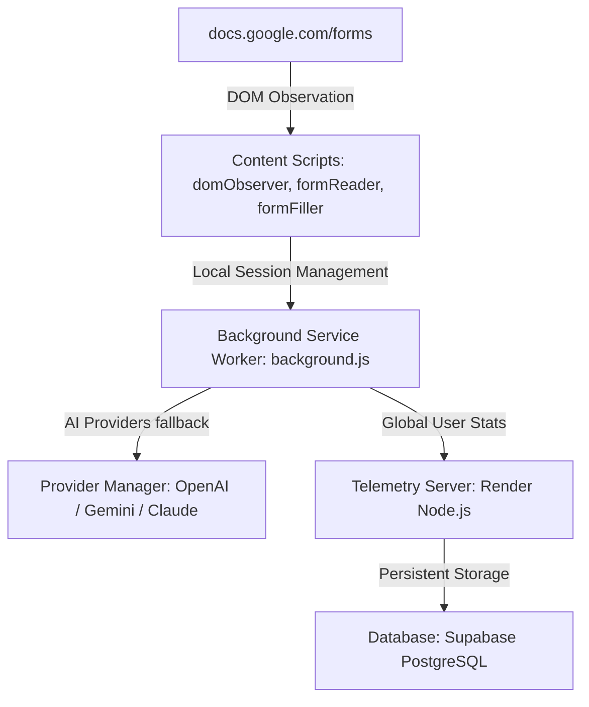
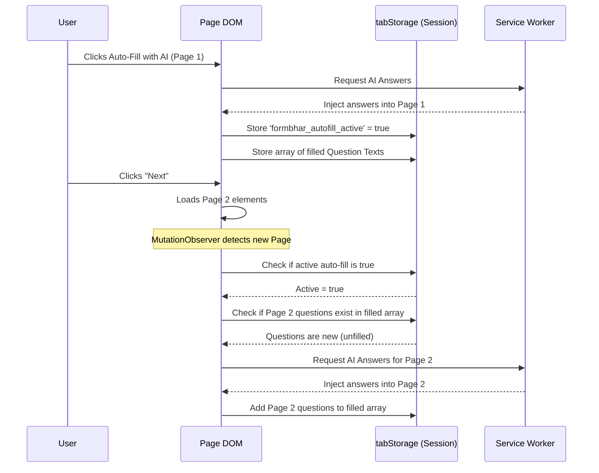

# 🧠 Detailed Documentation & System Architecture

This document provides a deep dive into the engineering, architecture, and security model of the **FormBhar Google Forms AI Auto-Filler** Chrome Extension and its integrated backend.

For basic installation and usage instructions, please refer to the main [README.md](README.md).

---

## 🏗️ System Flow & Architecture

FormBhar is split into a **Manifest V3 Extension** (which parses page contents, matches options, and communicates with AI engines) and a **Telemetry Backend** (which tracks user telemetry securely).



### Core Modules

#### 1. Background Service Worker (`background/`)
*   **`background.js`:** The central message router. It coordinates the lifecycle of async generation operations and mediates between content scripts and AI providers.
*   **`sessionManager.js`:** Provides an extra layer of transaction protection. Issues short-lived cryptographic tokens (`expires in 5 mins`) for every fill operation. Injected answer payloads are checked against this validation queue before the filler acts on them.
*   **`analytics.js`:** Telemetry pipeline. Configures an active browser connection and manages background `ping` alarms that natively wake up the ephemeral MV3 service worker to report active statistics without data loss.

#### 2. Content Scripts (`content/`)
*   **`domObserver.js`:** Monitors runtime modifications to the active webpage via `MutationObserver`. It dynamically injects the floating UI and **automatically handles multi-page forms** by maintaining a tab-specific in-memory session.
*   **`formReader.js`:** Universal form extractor. Parses HTML fields, dropdown structures, grids, and checkboxes using semantic indicators (like ARIA attributes) instead of fragile DOM tree class bindings.
*   **`formFiller.js`:** Injects answers into DOM nodes and dispatches synthetic `input` and `change` browser events. This forces Google Forms' underlying React state management to register the filled values.

#### 3. AI Interface Layer (`providers/`)
*   **`providerManager.js`:** The central routing factory. Features intelligent **quota-aware fallback**—if your primary AI provider errors out, it seamlessly tries other configured providers in order to ensure successful generation.
*   Modular files (`geminiProvider.js`, `openaiProvider.js`, `claudeProvider.js`) wrapping each engine API cleanly.

---

## 🔄 Smart Multi-Page Autofilling
To handle forms containing multiple paginated sections, FormBhar utilizes a state-machine mapped inside the tab's `sessionStorage`:



---

## 🔒 Security & Privacy Model
*   **Zero Local Leaks:** Extension settings and form history are strictly stored on the client machine using Chrome's secure `chrome.storage.local` API.
*   **API Key Protection:** Your private API keys are kept isolated inside the service worker context. The content script executing inside the webpage context never receives these keys.
*   **CORS Whitelisting:** The whitelisted host permissions in Manifest V3 ensure the extension has native system permission to contact AI servers directly from the service worker, removing the need for intermediary proxy servers.

---

## 📊 Database Schema (Supabase PostgreSQL)
The backend telemetry runs the following relational architecture inside Supabase:

```sql
CREATE TABLE IF NOT EXISTS users (
    id UUID PRIMARY KEY,
    created_at TIMESTAMP WITH TIME ZONE DEFAULT CURRENT_TIMESTAMP,
    last_active TIMESTAMP WITH TIME ZONE DEFAULT CURRENT_TIMESTAMP,
    extension_version TEXT
);

CREATE TABLE IF NOT EXISTS sessions (
    id UUID PRIMARY KEY DEFAULT gen_random_uuid(),
    user_id UUID REFERENCES users(id) ON DELETE CASCADE,
    started_at TIMESTAMP WITH TIME ZONE DEFAULT CURRENT_TIMESTAMP,
    last_ping TIMESTAMP WITH TIME ZONE DEFAULT CURRENT_TIMESTAMP,
    device_type TEXT,
    ip_address TEXT,
    country TEXT
);

CREATE TABLE IF NOT EXISTS form_logs (
    id UUID PRIMARY KEY DEFAULT gen_random_uuid(),
    user_id UUID REFERENCES users(id) ON DELETE SET NULL,
    form_title TEXT,
    questions_count INTEGER,
    created_at TIMESTAMP WITH TIME ZONE DEFAULT CURRENT_TIMESTAMP
);

CREATE INDEX IF NOT EXISTS idx_sessions_last_ping ON sessions(last_ping);
```
